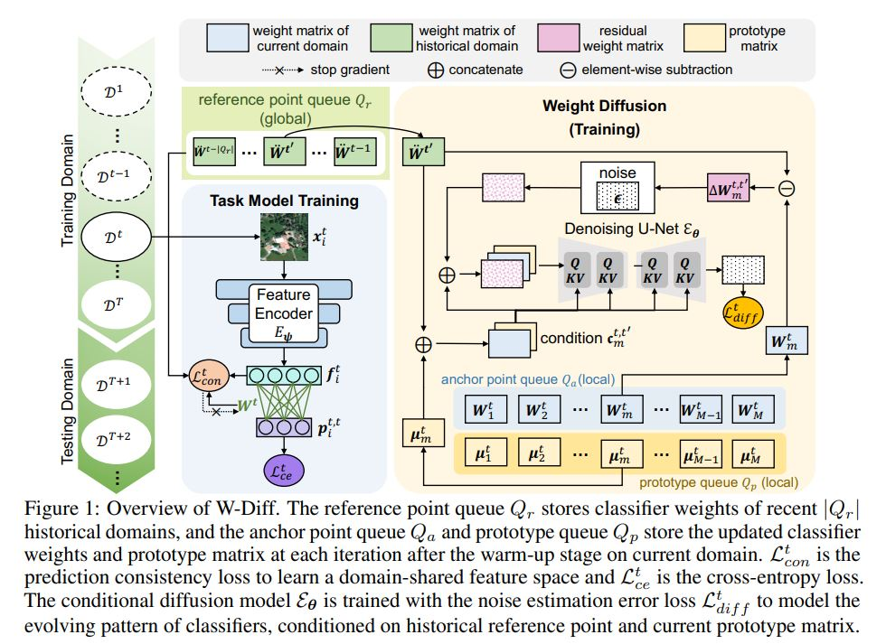

<div align="center">  
  
**Weight Diffusion for Future: Learn to Generalize in Non-Stationary Environments [NeurIPS 2024]**

[](https://openreview.net/pdf?id=2cFUYnNL1m) &nbsp;&nbsp;
[](https://neurips.cc/media/PosterPDFs/NeurIPS%202024/96806.png?t=1730257792.3534477) &nbsp;&nbsp;

</div>


<!-- TOC -->

- [Overview](#overview)
- [Prerequisites Installation](#prerequisites-installation)
- [Datasets Preparation](#datasets-preparation)
- [Code Running](#code-running)
- [Acknowledgments](#acknowledgments)
- [Citation](#citation)

<!-- /TOC -->

## Overview

We propose a **Weight Diffusion (W-Diff)** approach, which is specialized for the evolving domain generalization (EDG) in the domain-incremental setting. W-Diff capitalizes on the strong modeling ability of diffusion models to capture the evolving pattern of optimized classifiers across domains.


## Prerequisites Installation

* The code is implemented with `Python 3.7.16` and run on `NVIDIA GeForce RTX 4090`. To try out this project, it is recommended to set up a virtual environment first.

    ```bash
    # Step-by-step installation
    conda create --name wdiff python=3.7.16
    conda activate wdiff

    # this installs the right pip and dependencies for the fresh python
    conda install -y ipython pip
  
    # install torch, torchvision and torchaudio
    pip install torch==1.9.1+cu111 torchvision==0.10.1+cu111 torchaudio==0.9.1 -f https://download.pytorch.org/whl/torch_stable.html

    # this installs required packages
    pip install -r requirements.txt
    ```

## Datasets Preparation

- Download [yearbook.pkl](https://drive.google.com/u/0/uc?id=1mPpxoX2y2oijOvW1ymiHEYd7oMu2vVRb&export=download)
- Download [fmow.pkl](https://drive.google.com/u/0/uc?id=1s_xtf2M5EC7vIFhNv_OulxZkNvrVwIm3&export=download) and [fmow_v1.1.tar.gz](https://worksheets.codalab.org/bundles/0xaec91eb7c9d548ebb15e1b5e60f966ab)
- Download [huffpost.pkl]( https://drive.google.com/u/0/uc?id=1jKqbfPx69EPK_fjgU9RLuExToUg7rwIY&export=download)
- Download [arxiv.pkl](https://drive.google.com/u/0/uc?id=1H5xzHHgXl8GOMonkb6ojye-Y2yIp436V&export=download)
- ONP and 2-Moons are provided in the "datasets" folder.
- rmnist will automatically download while running the code.

The data folder should be structured as follows:
    
    ```
    ├── datasets/
    │   ├── yearbook/     
    |   |   ├── yearbook.pkl
    │   ├── rmnist/
    |   |   ├── MNIST/
    |   |   ├── rmnist.pkl
    │   ├── ONP/	
    |   |   ├── processed/
    │   ├── Moons/	
    |   |   ├── processed/
    │   ├── huffpost/	
    |   |   ├── huffpost.pkl
    │   ├── fMoW/	
    |   |   ├── fmow_v1.1/
    |   |   |   |── images/
    |   |   |—— fmow.pkl
    │   ├── arxiv/	
    |   |   ├── arxiv.pkl
    ```

## Code Running

* Training and testing together:

    ```bash
    # running for yearbook dataset:
    python3 main.py --cfg ./configs/eval_fix/cfg_yearbook.yaml device 0
    
    # running for rmnist dataset:
    python3 main.py --cfg ./configs/eval_fix/cfg_rmnist.yaml device 1
  
    # running for fmow dataset:
    python3 main.py --cfg ./configs/eval_fix/cfg_fmow.yaml device 2
   
    # running for 2-Moons dataset:
    python3 main.py --cfg ./configs/eval_fix/cfg_moons.yaml device 3
    
    # running for ONP dataset:
    python3 main.py --cfg ./configs/eval_fix/cfg_onp.yaml device 4
  
    # running for huffpost dataset:
    python3 main.py --cfg ./configs/eval_fix/cfg_huffpost.yaml device 5
    
    # running for arxiv dataset:
    python3 main.py --cfg ./configs/eval_fix/cfg_arxiv.yaml device 6

    ```
  
If you meet the `"OSError: Can't load tokenizer for 'bert-base-uncased'."` when running code on the Huffpost and Arxiv datasets, you can try to add `HF_ENDPOINT=https://hf-mirror.com` before the python commands. For example,
```
HF_ENDPOINT=https://hf-mirror.com python3 main.py --cfg ./configs/eval_fix/cfg_huffpost.yaml device 5
```
  
* Testing with saved model checkpoints:

   You can download the models trained by W-Diff [here](https://github.com/BIT-DA/W-Diff/releases/tag/model_checkpoints) and put them into `<root_dir>/checkpoints/`.

   ```bash
  # evaluating on ONP dataset
   python3 main_test_only.py --cfg ./configs/eval_fix/cfg_onp.yaml --model_path 'abs_path_of_onp_model.pkl' device 5
    ```

## Acknowledgments

This project is mainly based on the open-source project: [Wild-Time](https://github.com/huaxiuyao/Wild-Time), [EvoS](https://github.com/BIT-DA/EvoS) and [LDM](https://github.com/CompVis/latent-diffusion). We thank the authors for making the source code publicly available.


## Citation

If you find this work helpful to your research, please consider citing the paper:

```bibtex
@inproceedings{xie2024wdiff,
  title={Weight Diffusion for Future: Learn to Generalize in Non-Stationary Environments},
  author={Mixue Xie, Shuang Li, Binhui Xie, Chi Harold Liu, Jian Liang, Zixun Sun, Ke Feng, Chengwei Zhu},
  booktitle={Advances in Neural Information Processing Systems (NeurIPS)},
  year={2024}
}
```

